# Writing Hypar Functions in C#

By uploading a function to Hypar you can produce multiple options for a building problem in just a few seconds, and combine them with other people's functions to create rich, realistic designs. In this introduction to Hypar, we'll work with a much simpler function that generates masses of variable dimensions.

## Tutorial Videos

### Installing and Using the Hypar CLI

<iframe width="560" height="315" src="https://www.youtube.com/embed/-0sKYpekdqI" frameborder="0" allow="accelerometer; autoplay; encrypted-media; gyroscope; picture-in-picture" allowfullscreen></iframe>
<div style="page-break-after: always;"></div>

## Pre-Flight Check

Before getting started, there are a few things you'll need and some other things you might want to know.

### Things you'll need

- A 'modern' web browser.
  - We'll use **Google Chrome** for this guide, but **Firefox** or **Brave** should also work fine.
    - [Chrome](https://www.google.com/chrome/)
    - [Firefox](https://www.mozilla.org/en-US/firefox/new/)
    - [Brave](https://brave.com/download/)
- **Visual Studio Code** (Windows, Mac OS, Linux) or any other C#-compatible code editor.
  - We strongly suggest using **VSCode** to follow along with this tutorial, although Visual Studio will also work fine.
    - [Download VSCode](https://code.visualstudio.com/)
- A Hypar Account:
  - Sign up at <a href="https://hypar.io" target="_blank">hypar.io</a>.
- Access to a command line for your operating system.
  - We'll use the **Windows Command Prompt** for this guide, but other operating system command prompts should work similarly.
    - Windows: Hypar is known to work on the windows command prompt and git bash.
      - Some users have experienced issues using Hypar on PowerShell. PowerShell is not recommended.
    - Mac: Hypar is known to work on bash and zsh.
    - Linux: Hypar is known to work on zsh.
- [.NET Core 3.1](https://dotnet.microsoft.com/download/dotnet-core/3.1)
  - Hypar uses the cross-platform dotnet framework created and maintained by Microsoft. The version number is important! There might be issues with earlier or later versions of .NET Core. **Be sure to download the SDK installer from the left-hand side, not the runtime.**

### Things you might want to know
- It's helpful to review the [short conceptual overview of Hypar Elements, Functions, and Workflows](./index.md) before beginning this tutorial. 
- Basic familiarity with the **C#** programming language will help, but if you're not familiar with C# we'll do our best to walk you through making changes to the initial code you'll get by following the steps in this guide.
- If you want to share your Hypar functions, you have to explicitly make your work public, so don't worry that perfect strangers are judging your work. They will, but only if **<u>you</u>** decide to make them public.
- The procedures you'll use in this guide compile your code on your desktop and only upload the resulting binary file. No one at Hypar will examine your source code because we won't have it unless you make it public by some other means or if you send it to us so we can help you solve a problem.
- None of the Hypar libraries you'll use in this guide bind your code to Hypar web services. For example, if you'd like to use the Elements library for a desktop application, it's an [open source project on GitHub](https://github.com/hypar-io/Elements) and will always be free for anyone to use or extend. You don't even have to tell us you're using it.

<div style="page-break-after: always;"></div>

## Installing and Using the Hypar Command Line Interface (CLI)

Open a Command Prompt (`cmd.exe` on Windows, or Terminal on Mac or Linux) and input the following command to install the Hypar CLI:

```bash
dotnet tool install -g hypar.cli
```

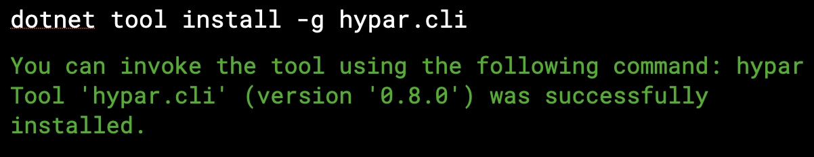

Close and reopen the Command Prompt to finish the installation.

Sign in to Hypar with this command in the Command Prompt:

```bash
hypar sign-in
```


<div style="page-break-after: always;"></div>

## Creating a Function

Next, return to the [Hypar web interface](https://hypar.io) and sign in. Scroll down to see **Your Functions**, and click **New Function** followed by **New C# Function**.


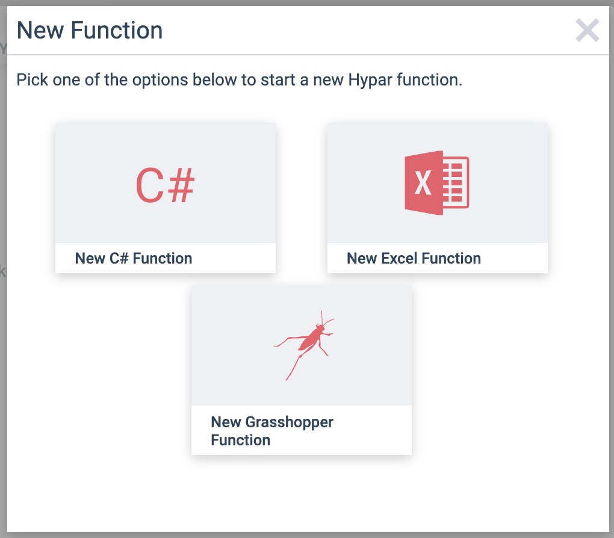

This wizard will take you through setting up your function. For consistency with the rest of this example, give your function the name **Starter Function**.


Click **Next** to proceed to configuring your function's inputs. Click or drag three "Range" inputs and name them Width, Length, and Height, and set their minimum values to 1:

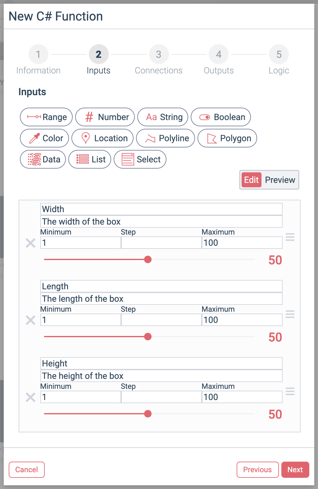

Go on to the next step, and click next again so that **Step 4: Outputs** is highlighted at the top. Click the **+** to add a new output to report the box's volume, and configure it like so:


Move on to the final step, **Logic**. Click "Publish Function," and then click the  button to copy the terminal command.


Now your function has been published (privately) to Hypar! Next, we'll write some code to define the logic for the function.

Return to your command prompt. Decide where you want Hypar to save the code for your function on your computer, and use the `cd` command to set that location as the current working directory:

```bash
cd C:/users/yourUserName/repos
```

Then paste the command you copied from the Hypar web interface, and run that (don't copy the one below, it won't have the right ID):

```
hypar new --function-id=96a0df70-2a7d-4612-9c0e-7f6d86830576
```

A bunch of messages will go by as Hypar sets up your local project.


Next, open VS Code and open the project folder we just created. It should be in the location you picked earlier, with the folder name "StarterFunction."

The Hypar CLI just created a bunch of files for you. Here's what that looks like in VS Code:


It may seem like a lot, but the good news is you rarely have to edit most of these files — Hypar takes care of all of that for you. Any file you see that ends with `.g.cs` is not meant to be edited by you.

The file we care about most is StarterFunction.cs in the `/src` directory — this contains the logic for your function. Let's open it up.

The `Execute` method is the entry point into our function. It doesn't do anything very exciting right away; it creates an "Outputs" object, and returns it.

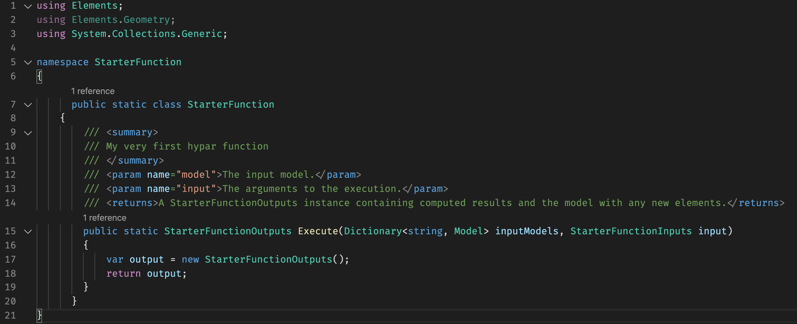

Note that the method has a few arguments. The one called `input` contains the inputs we defined earlier, like Width, Length, and Height. Let's use some of those inputs to create a rectangle. Add this line to your function, in between the two existing lines of the method:

```csharp
var rectangle = Polygon.Rectangle(input.Width, input.Length);
```

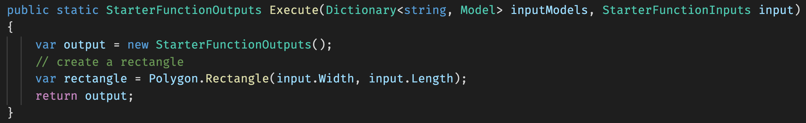

Next we'll make a `Mass` Element to pass out to the Hypar 3d environment. Note that if you want something to show up in the 3d view, it has to be an Element of some kind. Add this line after the rectangle:

```csharp
var mass = new Mass(rectangle, input.Height);
```


We also have to put the mass we created in the output model, like so:

```csharp
output.Model.AddElement(mass);
```

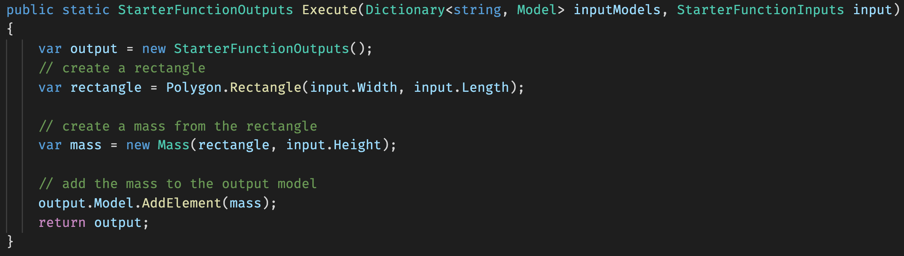

Finally, we created an output called `Volume` to report the box's volume. These data outputs are provided to the constructor for the `Outputs` object — so let's edit the first line of our method to look like this:

```csharp
var output = new StarterFunctionOutputs(input.Width * input.Length * input.Height);
```

Our function should look like this when we're all done. **Be sure to save the file!**

```csharp
public static StarterFunctionOutputs Execute(Dictionary<string, Model> inputModels, StarterFunctionInputs input)
        {
            // create an outputs object and populate any output values
            var output = new StarterFunctionOutputs(input.Width * input.Length * input.Height);
            // create a rectangle
            var rectangle = Polygon.Rectangle(input.Width, input.Length);

            // create a mass from the rectangle
            var mass = new Mass(rectangle, input.Height);

            // add the mass to the output model
            output.Model.AddElement(mass);
            return output;
        }
```
<a href="https://gist.github.com/andrewheumann/665dbc91b9c199973db16ba61627d0ba" target="_new">View on Github</a>

To publish our changes to the web, open up your command prompt again (or open VS Code's integrated terminal). Make sure your working directory is the one Hypar created for you — you might need to `cd StarterFunction` first. Then publish your function logic like this:

```bash
hypar publish
```


Now your function logic has been added to your function on Hypar. Let's go test it out! Return to <a href="https://hypar.io" target="_blank">hypar.io</a> and sign in.

Create a new workflow by clicking **New Workflow** and selecting **New Blank Workflow.** Once it opens up, give it a name in the nav bar. Type in any name you want (perhaps "Starter workflow"). You'll see this screen:

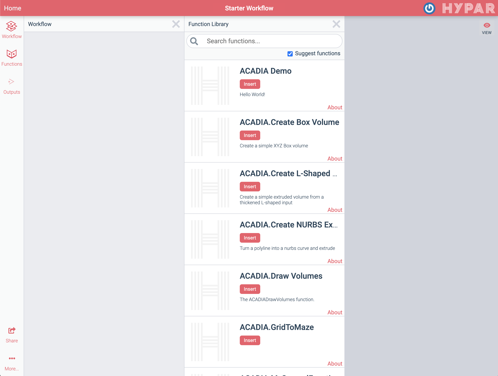

In the Function Library panel, search for "Starter Function" (or whatever you named your function).

Now let's try out our function. Click **Insert** on Starter Function and **hide** the Function Library by clicking the "X" to close it. Your function will run automatically and you should see something like this:

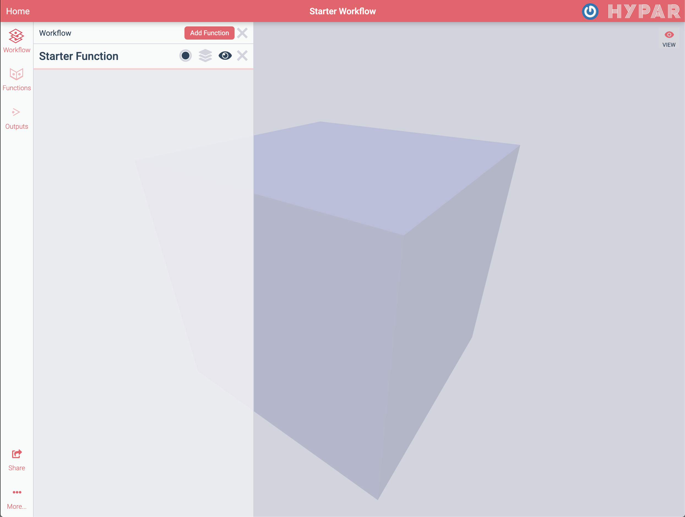

<div style="page-break-after: always;"></div>

You've just run a web application that you created! Click in the 3D view to zoom, pan, and rotate the result. Now click on Starter Function to open up its inputs. Try adjusting the sliders to see how the mass changes shape. Check the "Sample Range" checkbox under the height and width sliders. Then click the "Alternatives" button () on your workflow to see the options that have been generated.


In the alternatives list, you can see that your function has actually run many times with different input values. Click different alternatives to view them in 3D. The range sliders on the left are set to allow all possible lengths and widths. You can shrink these ranges to generate just the options you want.

This diagram summarizes the process we just went through to create, define, and publish our function:
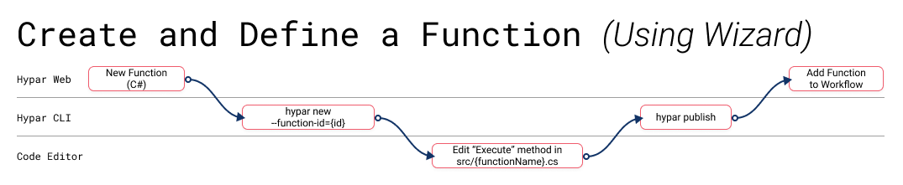

<div style="page-break-after: always;"></div>

## Editing our function

While developing a function, you may need to add additional inputs or outputs and change function logic. In this section we'll see how to do this.


In your workflow, you should see an "About" link under the name of your function. Click it to open the function details. As the owner of this function, you have the ability to make changes here.

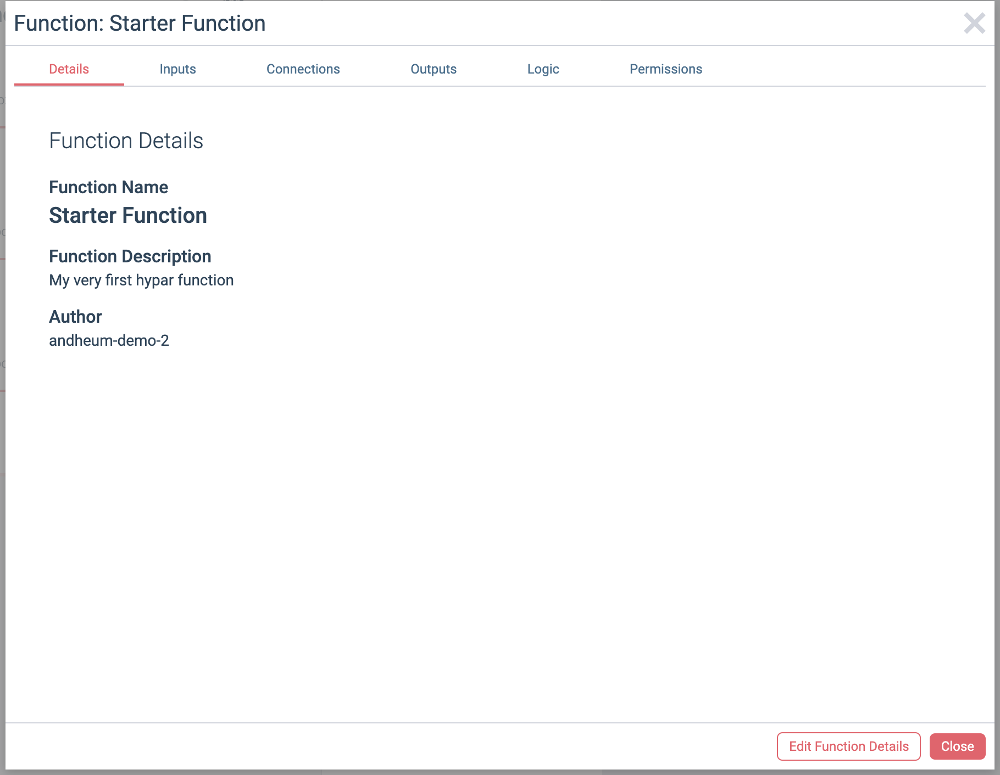

Switch to the **Inputs** tab and click **Edit Function Details** at the bottom of the window. This brings us to the same interface we used to create the inputs originally.


Let's add a new Color input by dragging "Color" to the top. We'll call it "Mass Color" and click the color swatch to set a different color as the default. Any value you set in this window will be the default value that shows up when your function is added to a workflow.


Switch to the **Outputs** tab so we can add an output for the base area of our mass. Click **+** to add it, and configure it like so:


Click **Save Changes** to register your changes to the function's configuration.

Next, we'll need to pull those changes into our local code files, so that we can use the new input and output. Switch to the **Logic** tab and copy the second command:

```bash
hypar pull && hypar init
```

`hypar pull` pulls the changes we made in the web interface to our `hypar.json` configuration file, and `hypar init` generates new code files from that configuration. You are also welcome to run these commands independently — you don't need to copy them from the web every time.

Let's return to VS Code, and take a closer look. If you select `hypar.json` in the righthand side, you can view the configuration that describes this function.

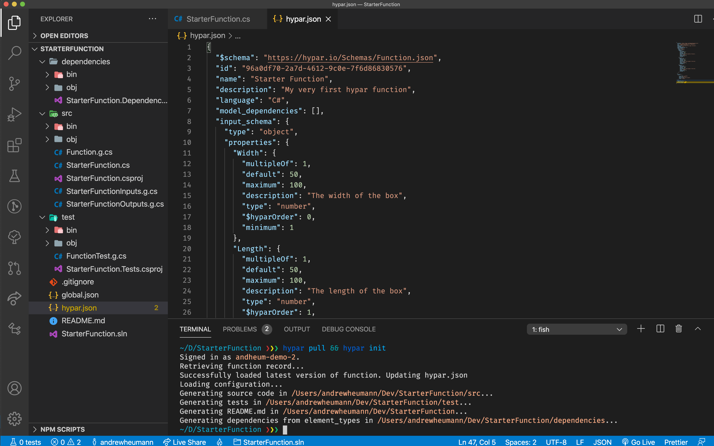

If you scroll down, you should see our new Color input and Area output reflected:


<div class="NOTE">
<h5>NOTE</h5>
Advanced users may find it easier to edit <code>hypar.json</code> manually rather than editing the function in the web UI and running <code>hypar pull</code> — it's completely up to you. Just remember to use <code>hypar init</code> after any changes to <code>hypar.json</code> to make sure the corresponding C# code gets regenerated.
</div>

Returning to `StarterFunction.cs`, we can take advantage of our new inputs and outputs. We'll edit the first line to add the base area output:

```csharp
var output = new StarterFunctionOutputs(input.Width * input.Length * input.Height, input.Width * input.Length);
```

And create a new material before we create our mass:

```csharp
var material = new Material("Box Color", input.MassColor);
```

And finally add the material to the mass.

```csharp
var mass = new Mass(rectangle, input.Height, material);
```

Here's how the updated `Execute` method code should look now:

```csharp
public static StarterFunctionOutputs Execute(Dictionary<string, Model> inputModels, StarterFunctionInputs input)
        {
            // create an output object
            var output = new StarterFunctionOutputs(input.Width * input.Length * input.Height, input.Width * input.Length);

            // create a rectangle
            var rectangle = Polygon.Rectangle(input.Width, input.Length);

            // create a new material
            var material = new Material("Box Color", input.MassColor);

            // create a mass from the rectangle
            var mass = new Mass(rectangle, input.Height, material);

            // add the mass to the output model
            output.Model.AddElement(mass);
            return output;
        }
```
<a href="https://gist.github.com/andrewheumann/283d37500940cbf225d1a541b65e10cc" target="_new">View on Github</a>

Be sure to save the file, and then publish these changes by running `hypar publish` again. Then we'll return to our workflow on Hypar, and reload the page to update the function. You may have to adjust a slider value to cause the function to recompute.


This diagram summarizes the steps we've taken to edit and update our function:

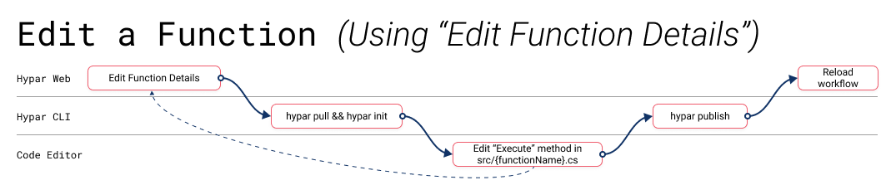

## Sharing your function

Your function always starts out private to you: only you can see and use it in a workflow. Once you're happy with your function, you can share it with the world! 

Click the "About" link under your function name again, and this time navigate to the **Permissions** tab.

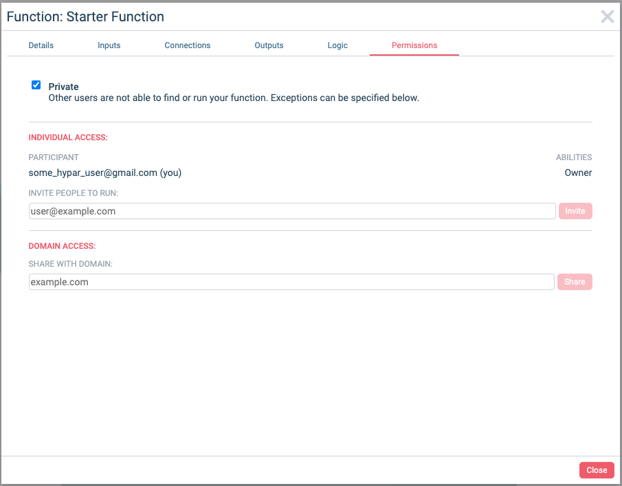

Uncheck the **Private** checkbox to make your function public. You can also choose to share it in a more limited way, by sharing with specific email addresses or with a whole email domain (like `myfirm.com`). 

You may also want to add a thumbnail to your function so others can get a sense of what it does. To do this, go to the **Details** tab, click **Edit Function Details**, and drag-and-drop an image on the drop zone. Then click **Save Changes** to save the thumbnail.


## Testing your function

When developing a function, it's useful to be able to make changes and visualize them immediately. The Hypar CLI provides a way to run your function locally and test it in the context of a workflow.

Return to your workflow, and remove your function from the workflow by clicking the "X."


Then go to the Hypar menu in the upper-right hand corner of the window, and select **Test a Local Function**


Click the "Copy to clipboard" button under the command: 

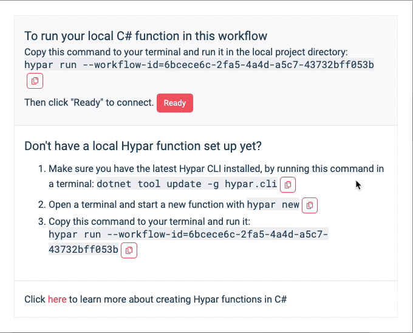

Then return to your terminal, ensure you're in your project directory ("StarterFunction") and paste the copied command, which should look like this:
```bash
hypar run --workflow-id=6bcece6c-2fa5-4a4d-a5c7-43732bff053b
```

Wait until you see this message:
```
Workflow update subscription acknowledgement received with id 518f1c6f-1b07-40e9-8461-fbc8fdbe3c06. Waiting for workspace updates...
```
And then return to the workflow and click the "Ready" button. 


Now, when you edit the inputs of the function, they're passed to your locally-running function, instead of being executed on the cloud.

The `hypar run` command we pasted earlier stays running continuously until we exit. While it's running, it serves the local function, and also monitors your code for changes. If you make changes to `hypar.json` or to your C# code, it will rebuild the function and re-execute dynamically. This makes it easy to write code, quickly try things out, and visualize how they will function on Hypar.

Let's make some changes to our code, with `hypar run` still running. We'll insert a void running through our mass. For this we'll need to create a smaller rectangle inside our first one, and create a profile from those two rectangles. First, we'll make the second rectangle: 
```csharp
var innerRectangle = Polygon.Rectangle(input.Width * 0.5, input.Length * 0.5);
```
And then a Profile from the two rectangles:
```csharp
var profile = new Profile(rectangle, innerRectangle);
```
And then edit the line where we make the `Mass` to use our new profile:
```csharp
var mass = new Mass(profile, input.Height, material);
```

The updated execute method should look like this: 
```csharp
public static StarterFunctionOutputs Execute(Dictionary<string, Model> inputModels, StarterFunctionInputs input)
        {
            // create an output object
            var output = new StarterFunctionOutputs(input.Width * input.Length * input.Height, input.Width * input.Length);

            // create a rectangle
            var rectangle = Polygon.Rectangle(input.Width, input.Length);
            
            // create an inner void rectangle
            var innerRectangle = Polygon.Rectangle(input.Width * 0.5, input.Length * 0.5);
            
            // create a profile from the two rectangles
            var profile = new Profile(rectangle, innerRectangle);

            // create a new material
            var material = new Material("Box Color", input.MassColor);

            // create a mass from the rectangle
            var mass = new Mass(profile, input.Height, material);

            // add the mass to the output model
            output.Model.AddElement(mass);
            return output;
        }
```
<a href="https://gist.github.com/andrewheumann/f3c47f74047567f6edf9661f795aa3ab" target="_new">View on Github</a>

As soon as you save your code, you should see the function results update in your workflow:


When you're happy with your local changes, hit ctrl+C in the terminal to stop `hypar run`. 

Finally, publish your updated function with `hypar publish`. The next time you use it in a workflow, it will reflect the changes you made. Anyone you've shared your function with will also have access to the latest and greatest version you just published. 

This diagram summarizes the steps we've taken to edit and test our function with live preview:

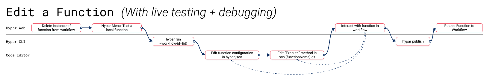

## What's next?

Congratulations on creating your first Hypar function! There's more to learn, but you should start thinking about building a real, useful function. Here are a few tips for deciding what to make:

- Solve one small problem. Hypar Functions are easy to compose. No single function needs to do too much on its own.
- Take something you've done before and do it again on Hypar.
- Scratch an itch. What do you hate doing manually? What would look cool? What would look silly?
- You don't need to be original. Just get started. Feel free to make another version of something you've already seen.

Here are some other good resources:
- [Hypar CLI Reference](./Hypar-CLI-Reference.md)
- [Hypar's Discord live chat](https://discord.gg/Ts6mzXg). Lots of people should be there to answer questions or share ideas.
- [Hypar's YouTube channel](https://www.youtube.com/c/hypar) has walkthrough videos and livestreams.
- The [Elements GitHub repository](https://github.com/hypar-io/Elements) and the tabs on top of this page have more information about Hypar's data model.
- [Hypar's Building Blocks repo](https://github.com/hypar-io/BuildingBlocks) has the source code for many Hypar functions. Read those to see how they work, and feel free to branch or improve any of them.
