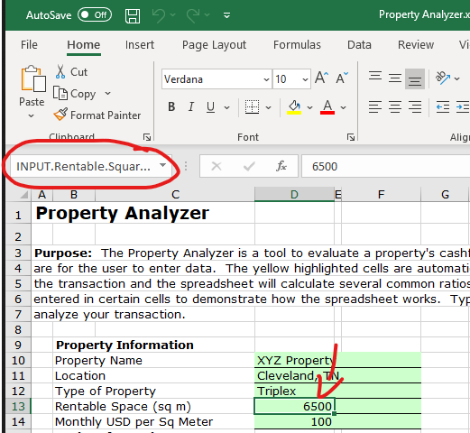
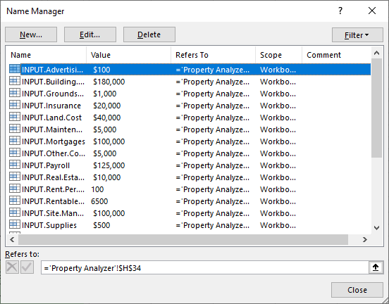
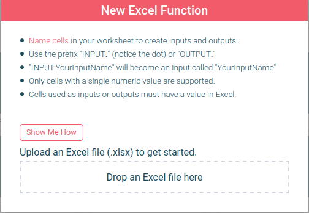
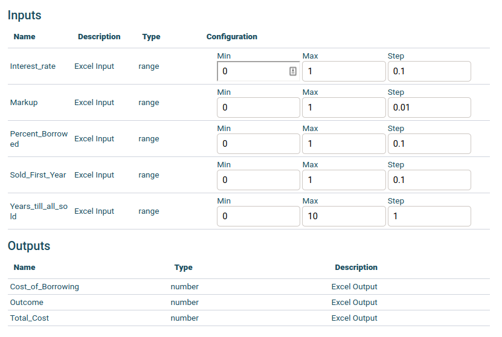

# Getting Started

All Hypar functions (Excel, Grasshopper, C# etc..) work by receiving some Inputs, executing some logic, and then returning some Outputs.  When we turn Excel spreadsheets into a Hypar functions we are talking about an Excel spreadsheet acting as the "logic" between some Inputs and some Outputs.

Excel functions can be created by uploading an Excel spreadsheet to Hypar where the system exposes some named spreadsheet cells as Inputs to the function and other named cells as Outputs from the formulas contained in the spreadsheet.

# Prepping Your Excel File.

Before uploading your file to Hypar, designate some spreadsheet cells as Inputs and some cells as Outputs by using the Excel feature called Named Ranges. Cells named with the prefix "INPUT." become Inputs, and, and names that start with "OUTPUT." become Outputs.

There are two places with Excel where you can see cell names.

First, when a cell is selected you can see and edit the name in the upper left of the Excel spreadsheet view.

Second, under the "Formula" tab, there is a button called "Named Ranges"  with a dialog that will pop up, showing you all of the named regions in the spreadsheet.

Name some cells in a spreadsheet, prefixing with INPUT. and OUTPUT. and when you're done, proceed to the next section.

# Upload to Hypar

Now that your Excel file is equipped with cells named <strong>INPUT.[your name here]</strong> and <strong>OUTPUT.[your name here]</strong> you're ready to upload it to Hypar.

Navigate to [https://hypar.io](https://hypar.io) , sign in, and you should see the workflow gallery.

Now scroll to the section labeled "Your Functions" and click on the "New Function" button.

Choose "New Excel Function"

Now you'll see a dialog with a summary of the instructions, and a drop box to which, you can drag your prepared Excel spreadsheet, or click and choose the file from a file dialog.

Once you drop your Excel file on the target box your file is uploaded to Hypar where Inputs and Outputs are extracted. When the process is complete, you should see a summary of the resulting function's characteristics:

This dialog box lets you edit your function name and description and shows you a list of the Inputs and Outputs found when Hypar analyzed your file for Named cells. If you like what you see, click the "Publish Function" button. 
Here we see the detailed view of your function, and if you would like to make further edits click on "Edit Function Details"

# Editing the Function on Hypar

Here you can use "Edit Function Details" to change the function name and description, upload a thumbnail for your function's card on Hypar, and even upload a new Excel file if you need to update the spreadsheet with new formulae or edited Inputs and Outputs.

You can also edit the numeric range of your Inputs. Hypar tries to choose smart defaults based on your initial values, but you should double check that all the values here make sense.

Now it's time to run your function!  Make note of your function's name, and then click close (or anywhere outside of this window) to go back to the gallery. Now click "New Workflow", and select "New Blank Workflow" as your template.

You should now be in a blank Workflow, where you can rename your Workflow to something you'll remember.

After that, choose "Add Function", search for your function name, and add it to your Workflow.  

Now, click on your function, move any sliders you want to adjust, and to see the results, click to open the Output pane.  

Congratulations, you've finished creating an Excel function with Hypar!