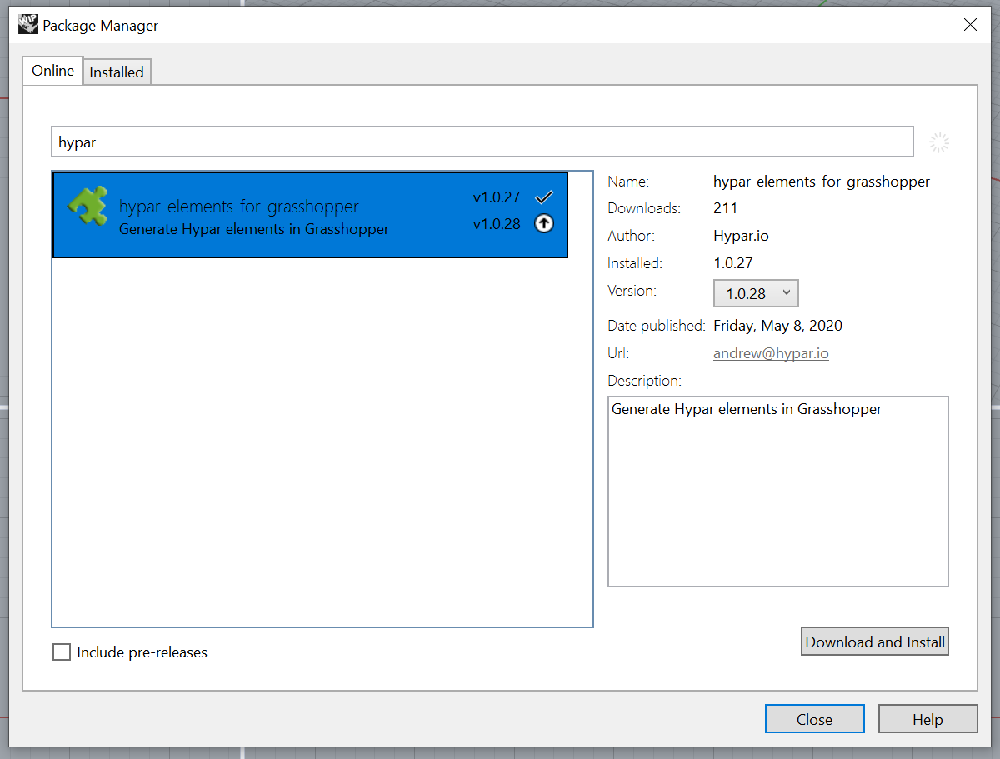
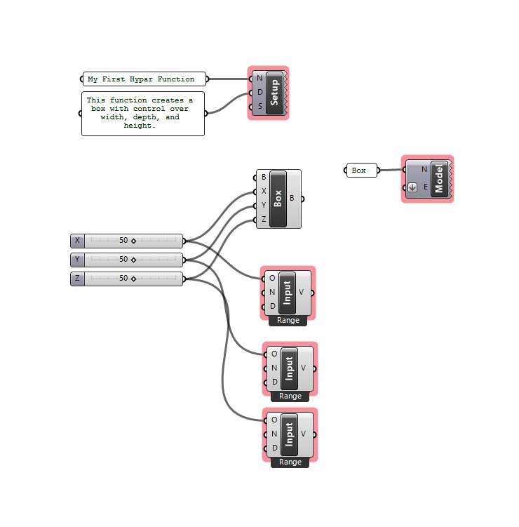
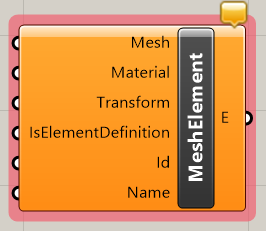
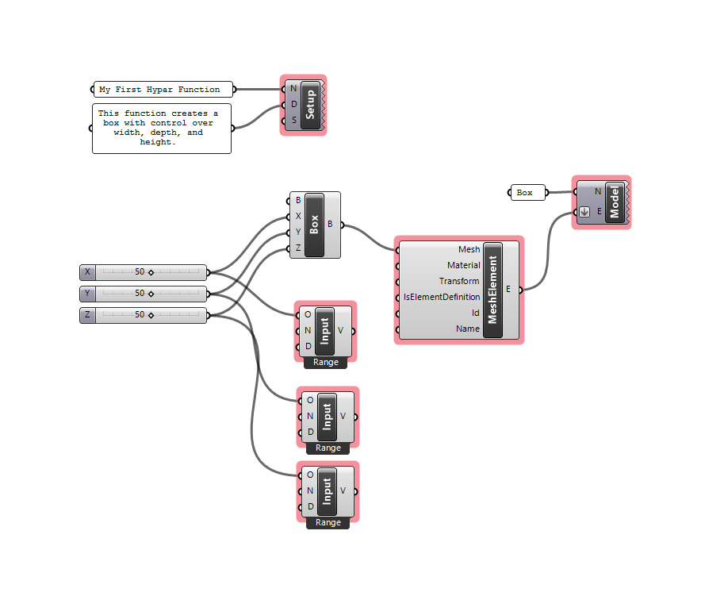
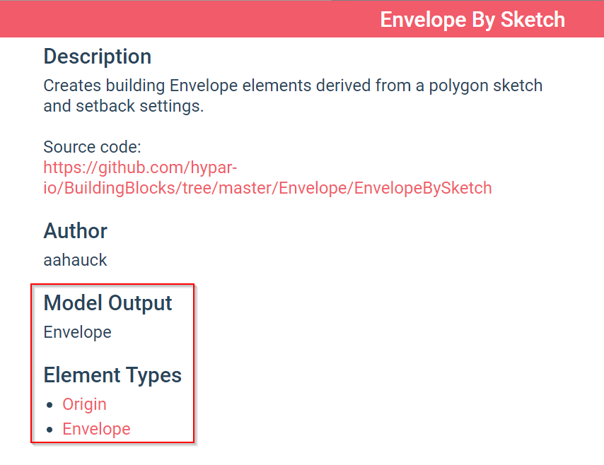
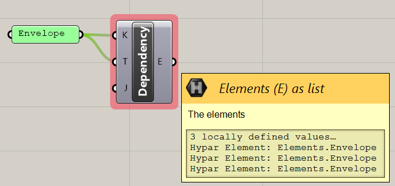

# Grasshopper Functions V1
You can follow the video tutorials below, or walk through the step-by-step guide at your own pace; they cover roughly the same information.

## Video Tutorials
<iframe width="560" height="315" src="https://www.youtube.com/embed/FE8BeWSE_WI" frameborder="0" allow="accelerometer; autoplay; encrypted-media; gyroscope; picture-in-picture" allowfullscreen></iframe>

### Tutorial Index
- [Part 1: Getting Started](https://www.youtube.com/watch?v=FE8BeWSE_WI&list=PLUI4W-9fe5g_6rSKww5ip50SiUGBBbmIZ)
- [Part 2: Outputs and Deconstruct Element](https://www.youtube.com/watch?v=x3EaAz0UavA&list=PLUI4W-9fe5g_6rSKww5ip50SiUGBBbmIZ&index=2)
- [Part 3: Input Types, Materials, and Mesh Elements](https://www.youtube.com/watch?v=xOWbQk619fE&list=PLUI4W-9fe5g_6rSKww5ip50SiUGBBbmIZ&index=3)
- [Part 4: Custom Schemas + Solids](https://www.youtube.com/watch?v=tjv875fA7Iw&list=PLUI4W-9fe5g_6rSKww5ip50SiUGBBbmIZ&index=4)
- [Part 5: Model Dependencies](https://www.youtube.com/watch?v=C8VALN0vtz0&list=PLUI4W-9fe5g_6rSKww5ip50SiUGBBbmIZ&index=5)
- [Part 6: Instances](https://www.youtube.com/watch?v=19dqWo9xrcc&list=PLUI4W-9fe5g_6rSKww5ip50SiUGBBbmIZ&index=6)

## Installing the Grasshopper Plugin
To install the Hypar plugin for Grasshopper, it is best to use the Rhino Package Manager. In Rhino 6, type `TestPackageManager` in the Rhino Command line -- it may not autocomplete, but the command will work. In Rhino 7 or later, type `PackageManager` to open the dialog.

Search for Hypar, select the result, and click "Download and Install."

If Grasshopper was already running, you'll need to shut down Rhino and restart it, otherwise you can proceed to launch Grasshopper.

If you are having trouble with the package manager, you can also download the plug-in from [Food4Rhino](https://www.food4rhino.com/app/hypar-elements), but this is not recommended.

<h5>NOTE</h5>
Only Rhino 6 and 7 on Windows are fully supported. Rhino on Mac also works in most but not all cases.

## Building a simple function

To start, we'll build a very simple Grasshopper function: just a `Center Box` component with some sliders from 0 to 100 controlling X, Y, and Z.

We need to do three things to make this function ready for Hypar. Navigate to the Hypar tab in your Grasshopper window, and grab the following components from the `1. Setup` section.

1. Give your function a name and description with the  component.
2. Connect one  component to each of your Sliders (there should be three total.) Each slider should feed into the "O" input of the Function Input component.
3. Create a  component and supply it with a name.

Your definition should look like this:

Lastly, in order to produce geometry out of our function, we have to create Hypar Elements -- these are special objects that Hypar knows how to read and display. [You can learn more about Hypar Elements here](./Elements/WhatIsElements.md).

To create a Hypar Element in Grasshopper, we'll use the  component. Place it on the canvas, and right click it to open a menu of possible Element types:

Select "MeshElement" from the list. The component should change shape, generating inputs on the left-hand side for all the information that a "MeshElement" requires.

Connect your box to the "Mesh" input, and connect the "E" output to the "E" input of the  component we created earlier. The final definition should look like this:

## Publishing the function

Save the definition as a .gh file. Open [hypar.io](https://hypar.io), and log in. Scroll down until you see "Your Functions":

Click "New Function" and then click "New Grasshopper Function."

Drag and drop the .gh file you saved earlier onto the region marked "Drop a Grasshopper Definition Here," or click it to bring up a file browser and locate the file that way.

It will upload the file and load the information from it. Don't worry if it takes a little while -- it shouldn't show "Loading Function Details" longer than about 30 seconds.

When it has successfully loaded, you'll see a preview of the information it's gathered from your file. Feel free to edit the name and description of the file at this point.

Click "Publish Function," and when the dialog changes, click "Close." Your function should now show up under "Your Functions."

Next click "New Workflow," and choose "New Blank Workflow."

Search for your function in the Function Library, and click "Insert" when you've found it.

You should see a box appear in your model. Click on the function name to open its settings:

Adjust the sliders and watch the cube change dynamically. Congratulations! You've authored your first Hypar function with Grasshopper!

## Working with Elements and Custom Types

<h5>WARNING</h5>
Grasshopper for Mac does not support building custom types.

As shown in the previous section, to create geometry for the model that you can see in Hypar, you need to create Elements. This is done with the Construct Element component, which can take on a number of different types. However, it doesn't stop there! Many other types are available, and you can even [create your own custom types](./Types.md).

You can visit the [Types](Types.md) section for details, but for our purposes it suffices to know that a type is defined with a .JSON file hosted somewhere on the web. The [Hypar Schemas repository](https://github.com/hypar-io/schemas) collects a good number of these, but they can be hosted anywhere that's public.

If we want to construct an `Envelope` Element, for instance, we'll need to grab a reference to the Envelope schema.

Copy and paste this URL: `https://raw.githubusercontent.com/hypar-io/Schemas/master/Envelope.json` into a text panel in Grasshopper, and connect it to the "S" input of a  component, like so:

It will show "Loading" for a bit while it downloads that schema and loads the type. When it's done, all Hypar components will be able to use the `Envelope` type. If you right click a `Construct Element` component, you will now be able to create an Envelope:

## Solids and Representations

When you reference a custom type like `Envelope`, Hypar has no way of knowing how to construct its 3D geometry, so you have to explicitly provide a "Representation" of that geometry. The  component will accept a list of `Solid`s which can be used to describe the geometry. Here's an example of defining an `Envelope`, with an `Extrude` solid as its representation:

## Specifying Model Dependencies

In many cases, you'll want to build a function that references information from other functions in the model. Hypar functions can declare "Model Dependencies," and thereby access specific elements produced by other functions. A `Facade` function might depend on the `Envelope` produced by an `Envelope By Sketch` function, for instance.

Let's build a function that depends on Envelope. Log into Hypar, click "New Workflow."

This time, select the "Simple Tower" template.

Click on "Envelope By Sketch," and then click the "About" button.

Pay special attention to the information under "Model Output" and "Element Types":

Right click "Envelope" under "Element types," and copy the link address.

Open Grasshopper and start a new Definition. As in the previous section, we'll need to reference the "`Envelope`" type. The link we just copied contains the schema URL for this type; paste it into a text panel and connect it to the "S" input of a  component, like so:

Now place a  component. Type "Envelope" into a text panel, and connect it to the "K" input. This input should match the "Model Output" text we just referred to in the function details view on the Hypar web interface.

For common types like Envelope, reference geometry is automatically loaded. For more complex types, you may need to download a JSON representation of a model to use as test geometry to build your function against.

If your "Model Dependency" component shows no output, go to the workflow and click "Export" in the lower left-hand corner. In our case this is not necessary, but feel free to try it out.

Download the JSON file, and supply the file path to the "J" input of the Model Dependency component.

You'll notice that the Model Dependency component outputs several kinds of Elements.

An easy way to filter this down is to supply a type filter to the T input of the Model Dependency component. Connect your "Envelope" panel to this input as well to limit your dependency to Elements of type `Envelope`.

Now, connect a  component to the output of Model Dependency. It will automatically take on all the properties of an Envelope, and you can use any of the resulting outputs and geometry as information for your function. When the function is run on Hypar, this information will be replaced by the `Envelope`s in the workflow.

## Updating a Grasshopper Function on Hypar

You can update the version of the Grasshopper script for a given function. Just click the tile for that function in "Your Functions," and choose "Edit Function Details":

Just drop a new version of your script on the file drop zone to update the logic of your function.

## Limitations

* Currently Custom Type generation is not supported on Grasshopper for Mac.
* Only certain 3rd party plug-ins are currently supported on Hypar:
  * Wombat
  * TreeFrog
  * Human
  * Clipper Tools
  * MetaHopper
* Custom scripts (C#, VB.NET, and Python) are not currently supported.
* Function Execution has a time limit of 15-30 seconds. If your definition takes longer than this to run, you may experience timeouts on Hypar.

## Component Reference

| Category | Icon | Name | Description |
|----|-----|-----|-----|
|1. Setup||Hypar Function Setup|Use this component to set up the parameters of your Hypar function.|
|1. Setup||Function Input|Select a function input|
|1. Setup||Function Output|Designate a data output for your function|
|1. Setup||Model Output|Create a model output from elements|
|1. Setup||Model Dependency|Refer to other elements in the model|
|2. Elements||Deconstruct Element Instance|Deconstruct an Element Instance|
|2. Elements||Construct Element|Construct a Hypar element|
|2. Elements||Deconstruct Element|Use this component to deconstruct the properties of any element.|
|2. Elements||Material|Create a Elements.Material|
|2. Elements||Representation|Create a Elements.Geometry.Representation|
|2. Elements||Construct Element Instance|Construct an Element Instance from another element|
|3. Solids||Sweep|Create a Elements.Geometry.Solids.Sweep|
|3. Solids||Extrude|Create a Elements.Geometry.Solids.Extrude|
|3. Solids||Lamina|Create a Elements.Geometry.Solids.Lamina|
|4. Special||Model to JSON|Convert elements into a model and output it as JSON.|
