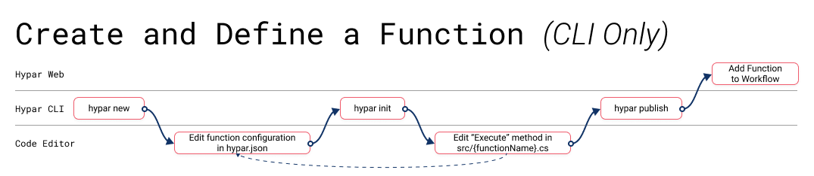

# Hypar CLI Reference

The Hypar Command Line Interface (CLI) connects your desktop to the Hypar cloud. It packages utilities for function authoring, code generation, testing, and synchronization with desktop applications. This page describes the commands supported by the Hypar CLI for your reference. This information is also available from within the CLI at any time by running `hypar --help` in your terminal. 

[Installation instructions](./C-Sharp.html#installing-and-using-the-hypar-command-line-interface-cli)

## Commands
| Command | Description |
|---------|-------------|
|`new`                   |Create a new Hypar function. |
|`publish`               |Publish your function to Hypar.|
|`delete`                |Delete a function from Hypar.|
|`generate-catalog`      |Generate code for a ContentCatalog.|
|`generate-types`        |Generate user element types from the specified url.|
|`init`                  |Generate input, output, and function classes from a hypar.json.|
|`rename`                |Rename a function.|
|`sign-in`               |Sign in to Hypar.|
|`sign-out`              |Sign out of Hypar.|
|`run`                   |Run the hypar function found in the current directory. Defaults to running the function whenever the function's code or its input change, but can also run across a provided list of input values instead.|
|`pull`                  |Pull changes made to your function via the Hypar web UI down to your local hypar.json.|
|`version, --version`    |Display version information
|`update`                |Update the current function to the latest version of Hypar, or to a specified version.|
|`hub`                   |Work with the hypar hub.|

## Typical C# Function Development Flows

