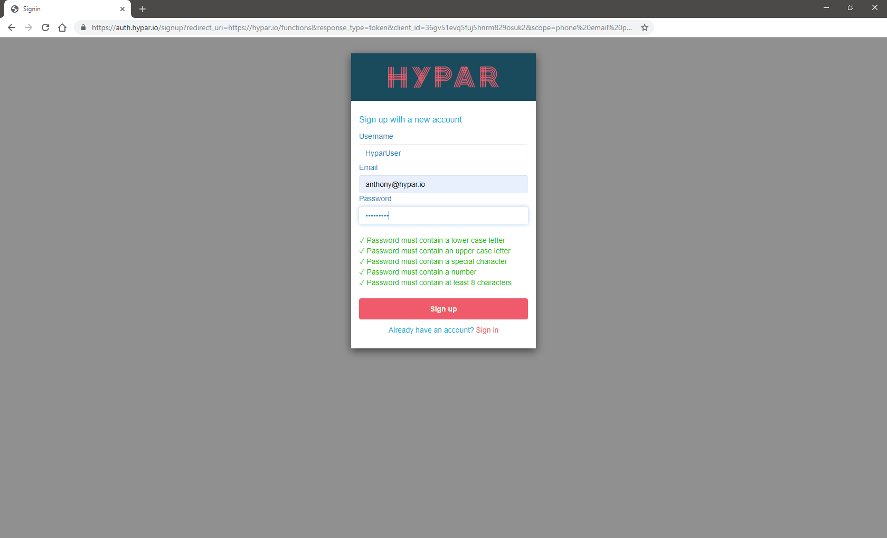

# Getting Started with Hypar
Here's a short video that explains some of the Hypar concepts that we'll be using in this getting started guide.

<video width="100%" controls>
  <source src="https://hypar.io/videos/elements+functions+and+workflows.mp4" type="video/mp4">
</video>

Hypar is a cloud platform for generating buildings that makes it easy to publish, distribute, and maintain your building design logic. Rather than requiring web development skills to scale and deliver your design logic, Hypar lets you concentrate on what you want to get done while the platform creates the interface for your audience and provides computation, visualization, delivery, interoperability, and access control for your functions.

By uploading a function to Hypar you can produce multiple options for a building problem in just a few seconds, and combine them with other people's functions to create rich, realistic designs. In this introduction to Hypar, we'll work with a much simpler function that generates masses of variable dimensions.

<div style="page-break-after: always;"></div>

## Pre-Flight Check
Before getting started, there are a few things you'll need and some other things you might want to know.

### Things you'll need
* A 'modern' web browser. 
    * We'll use **Google Chrome** for this guide, but **Firefox** or **Brave** should also work fine.
        * [Chrome](https://www.google.com/chrome/)
        * [Firefox](https://www.mozilla.org/en-US/firefox/new/)
        * [Brave](https://brave.com/download/)
* **VSCode** (Windows, Mac OS, Linux) or any other C#-compatible code editor.
    * We strongly suggest using **VSCode**, because we make a very helpful Hypar Plugin for VSCode (see the next bullet).
        * [Download VSCode](https://code.visualstudio.com/)
* If you're using VSCode, install the **Hypar Function Builder** extension:
    * Select **"Extensions"** in the **"View"** menu.
    * Search for **"Hypar".**
    * Click **"Install"** on **Hypar Function Builder**.
* Access to a command line for your operating system.
    * We'll use the **Windows Command Prompt** for this guide, but other operating system command prompts should work similarly.
* Microsoft .Net Core 2.1. 
    * Hypar uses the cross-platform dotnet framework created and maintained by Microsoft. The version number is important! There might be issues with later or earlier versions of .Net Core.
        * [.Net Core 2.1](https://dotnet.microsoft.com/download/dotnet-core/2.1)
    
### Things you might want to know
* Basic familiarity with the **C#** programming language will help, but if you're not familiar with C# we'll do our best to walk you through making changes to the initial code you'll get by following the steps in this guide.
* If you want to share your Hypar functions, you have to explicitly make your work public, so don't worry that perfect strangers are judging your work. They will, but only if **<u>you</u>** decide to make them public.
* The procedures you'll use in this guide compile your code on your desktop and only upload the resulting binary file. No one at Hypar will examine your source code because we won't have it unless you make it public by some other means or if you send it to us so we can help you solve a problem.
* None of the Hypar libraries you'll use in this guide bind your code to Hypar web services. For example, if you'd like to use the Elements library for a desktop application, it's an [open source project on GitHub](https://github.com/hypar-io/Elements) and will always be free for anyone to use or extend. You don't even have to tell us you're using it.

<div style="page-break-after: always;"></div>

## Signing up for Hypar

To upload anything to the Hypar platform, you're going to need an account. 
Point your browser to <a href="https://hypar.io" target="_blank">https://hypar.io</a>, and you should see a page that looks like this. 


<div style="page-break-after: always;"></div>

If you don't have an account already, click on the **Create a free account** button below the logo. That should take you to the Sign Up screen.


<div style="page-break-after: always;"></div>

Fill in a username, an email address you can access, and the password you'd like to use. Then click on the **Sign up** button in the center of the screen.



<div style="page-break-after: always;"></div>

Then we do some explaining:


Now check the email account you supplied for a message that looks something like this:


<div style="page-break-after: always;"></div>

Click on the <u>Verify Email</u> link in the message and you should see a confirmation page:


That's it! You now have a Hypar account. Later in this guide you'll sign in to see your first function in Hypar Explore.

<div style="page-break-after: always;"></div>

## Installing and Using the Hypar Command Line Interface (CLI)

Open a Windows Command Prompt and input the following command:

```bash
dotnet tool install -g hypar.cli
```


Close and reopen the Command Prompt to finish the installation.

Now you're ready to send your first function to Hypar. First use the command prompt cd (for "<u>c</u>hange <u>d</u>irectory") command to navigate to the folder where you'd like to place your function project.

Try this in the Windows Command Prompt:
```bash
hypar new
```


<div style="page-break-after: always;"></div>

For consistency with the rest of this example give your function the name **StarterFunction**. A bunch of stuff happens that we'll explain in a moment, but in the meantime enter your Hypar user name and password:


<div style="page-break-after: always;"></div>

Now more stuff happens, but the important thing right now is to know that your function has been published (privately) to Hypar! 


With one command you've created a web application that we're going to customize and publish again (and again and again), but first let's see what we've got so far. <a href="https://hypar.io" target="_blank">Back to https://hypar.io</a>.

<div style="page-break-after: always;"></div>

This time, click on the **sign in** button on the left below the logo...


...and sign in using your new account:


<div style="page-break-after: always;"></div>

Once you sign in, you'll see something like the following screen:


<div style="page-break-after: always;"></div>

Create a new workflow using the form on the bottom left. Type in any name you want (perhaps "Starter workflow") and click **Create**. You'll see this screen:


Click **Add Function** in the top left of the screen to open the function library and search for "StarterFunction" (or whatever you named your function).


Click on the **more...** link on the lower right of your **StarterFunction** card:


<div style="page-break-after: always;"></div>

That checked **Private** box is what's keeping your new function invisible to everyone but you and the administrators of Hypar. If you ever want everyone to see your function, you'll have to uncheck that box and read our warning that the world is about to see your work. Try changing the setting, then make it private again.

Now let's make some options. Click **Insert** on StarterFunction and **hide** the Function Library. Your function will run automatically and you should see something like this:


<div style="page-break-after: always;"></div>

You've run a web application that you created by just typing `hypar new`! Click in the 3D view to zoom, pan, and rotate the result. Now click on StarterFunction's **Settings** and **Alternatives** buttons, the first two buttons after its name on the left:


<div style="page-break-after: always;"></div>
In the alternatives list, you can see that your function has actually run many times with different input values. Click different alternatives to view them in 3D. The range sliders on the left are set to allow all possible lengths and widths. You can shrink these ranges to generate just the options you want.

Now let's go back and look at everything that happened and what it means for writing your own custom Hypar functions in the future. We'll place blue boxes around what we're talking about, like this:


The first thing that happened was that the **hypar new** command created a new local project folder within the current folder. In Windows Explorer, the new folder looks like this:


The next thing **hypar new** did was add a test project into that folder, in the folder called **test** above. This is the project that will help you test your function updates locally before uploading them to Hypar.


<div style="page-break-after: always;"></div>

Then the **hypar new** command created a **hypar.json** file that you can see in the **StarterFunction** folder above. We'll use this file to customize and extend the default function.


Next the **hypar new** command executed something called **hypar init**, which created a couple of more important files in your project, but which you shouldn't have to worry about except to understand what they do and how they change as you edit your **hypar.json** file.


<div style="page-break-after: always;"></div>

If you open the **src** folder, you'll see these files:


The three files with names containing **.g.cs** are generated code files. You never need to edit these directly but it's important to know that the **hypar init** command generates them from the **hypar.json** file that we'll look at in a moment, because when you make changes to the **hypar.json** file you'll have to run **hypar init** again to update these files. 

These three files are what make your C# code compatible with Hypar services. They're kept separate so that your code won't become directly dependent on the Hypar platform but can easily take advantage of its services.

After **hypar init** executes, there's some housekeeping that completes the local changes, then after you sign in the **hypar new** command uploads your new function.

<div style="page-break-after: always;"></div>

Go back and open the StarterFunction directory in VSCode:


VSCode will look like this, with all of the files in the left column:


Now use Code to open the **hypar.json** file, and we'll look at how this configuration influences what you see when you work with a function on Hypar.

The **"inputs"** section of the **hypar.json** determines what inputs you see for the uploaded function:


The **"outputs"** section determines the values you see associated with each option:


In the next exercise, we're going add a new **Height** input to this function.

<div style="page-break-after: always;"></div>

## Adding a new function input

First, let's open the **src/StarterFunctionInputs.g.cs** file in Code and look at the **StarterFunctionInputs** class to see how the **hypar.json** turns into code. Note how the corresponding entries become public class properties:


<div style="page-break-after: always;"></div>

Edit your **hypar.json** file to look like the one illustrated below. Copy the **"Width"** output and change the copy's **name** and **description** values to refer to **"Height"** and **"The height"** instead of **"Width"** and **"The width"**. Insert a comma after the **"Width"** section's closing brace now that it's no longer the last input field:


Save this file and open the command prompt again, using the cd command to change the current directory to your project folder. Then run **hypar init**:


**hypar init** reads the json file to understand how to regenerate the input and output class files as well as the function file. Open **StarterFunctionInputs.g.cs** to see what changed.

<div style="page-break-after: always;"></div>


Now that we have this new entry for **Height**, we have to tell our function to use it. Open **StarterFunction.cs** and change the **var height = 1.0;** line to use the height input value instead:


<div style="page-break-after: always;"></div>

Now we have our new **Height** input. Let's send this up to Hypar using **hypar publish** and see how our function works now:


Opening **StarterFunction** on Hypar again, we now have a **Height** input in addition to the **Length** and **Width** inputs.  Unchecking "Sample Range" on height and setting its slider to 10m gives us a set of alternatives with identical heights and varied lengths and widths:


<div style="page-break-after: always;"></div>

What if we wanted a maximum height of 20m? Let's go back to the **hypar.json** file and change the maximum for the input range:


Save the file and run **hypar publish** again at the command prompt:


<div style="page-break-after: always;"></div>

When we open **StarterFunction** on Hypar again, the range can now be set to 20:


<div style="page-break-after: always;"></div>

## Adding a new function output

Hypar can also generate non-geometric data. In Hypar, click **"Show outputs"** in the top left. You should see something like this, although your volume result might be different:


<div style="page-break-after: always;"></div>

What if we also wanted to display the area of our cube? For this exercise we'll add a new output to the **hypar.json** and calculate the result we need. Add these new lines to the **hypar.json**:


<div style="page-break-after: always;"></div>

Copy the **"Volume"** section down and change its **"name"** field to **"Area"** and its **"description"** to **"The area"**. After those changes, on the command line in the project folder run **hypar init**:


Now in Code let's see what changed. Open **src/StarterFunctionOutputs.g.cs** and you should see your new **Area** output under the **Volume** output:


Also note that the **StarterFunctionOutputs** constructor at the bottom of the illustration has a new **double area** argument. Calculate and add the **area** output like this:


<div style="page-break-after: always;"></div>

Once you've made that change and saved the file, publish the function to Hypar again:


Return to Hypar, reload the page, and force StarterFunction to run again by tweaking one of its input parameters. Click **Show outputs** and you should see the result of your area calculation:


<!--
TODO: Labels can't be trivially added to masses right now.

What if we wanted to see these results in the graphic display as well?
We'll handle that by adding **properties** to the generated masses, and display them using the **Label** dropdown. For the moment the **Label** dropdown only has **None** as an entry:


<div style="page-break-after: always;"></div>

To add labels for our **volume** and **area** values open **StarterFunction.cs** in VSC. Move the two value calculations up under the **height** input, because we're going to need those values a little earlier so we can add them as properties to our **mass**:


<div style="page-break-after: always;"></div>

Before we add the **mass** to our Hypar **model**, we need to add a couple of **NumericProperty** entries to the **mass**. Add these lines before **model.AddElement(mass)**:


There's a lot happening in these two lines, so let's look at each part, using our new **Volume** property as an example of how both lines work. Since we're adding a property to our **mass**, we use its method **AddProperty**:


The first argument this method needs is a name for the new property, which in this case is **"Volume"**:


Next the method needs to know what kind of property you're going to add. Eligible values for this argument are **StringProperty** (if we were adding a string value), or in this case **NumericProperty**:


<div style="page-break-after: always;"></div>

The new **NumericProperty** needs two arguments: the value, which in this case is the **volume** variable calculated above, and then the **UnitType**, which for this output is **UnitType.Volume**:


Save the file and publish **StarterFunction** again:


<div style="page-break-after: always;"></div>

When you return to Hypar, click on the **Sample 20 Options** button in **StarterFunction** to create 20 new options, then click on one of the options to open it in the interactive display. In the **Label** dropdown you should see the two new properties you just added:


Select **volume** and you should see the value appear in the graphic display on the mass:


Now you see why we specified the **UnitType** for the new property. Specifying the **UnitType** as **UnitType.Volume** tells Hypar to add **m3** to the displayed value to denote cubic meters. Internally Hypar maintains all values in metric units. Functions can calculate the conversion to Imperial units if required. 

<div style="page-break-after: always;"></div>

If you select **area** in the **Label** dropdown, you should see the value notated in square meters:


You're not limited to simple values like these. You can add any static or calculated value you'd like to any Hypar Element (like Mass).  -->

## What's next?

Congratulations on creating your first Hypar function! There's more to learn, but you should start thinking about building a real, useful function. Here are a few tips for deciding what to make:
* Solve one small problem. Hypar Functions are easy to compose. No single function needs to do too much on its own.
* Take something you've done before and do it again on Hypar.
* Scratch an itch. What do you hate doing manually? What would look cool? What would look silly?
* You don't need to be original. Just get started. Feel free to make another version of something you've already seen.

Here are some other good resources:
* [Hypar's Discord live chat](https://discord.gg/Ts6mzXg). Lots of people should be there to answer questions or share ideas.
* [Hypar's YouTube channel](https://www.youtube.com/c/hypar) has walkthrough videos and livestreams.
* The [Elements GitHub repository](https://github.com/hypar-io/Elements) and the tabs on top of this page have more information about Hypar's data model.
* [Hypar's Building Blocks repo](https://github.com/hypar-io/BuildingBlocks) has the source code for many Hypar functions. Read those to see how they work, and feel free to branch or improve any of them.

