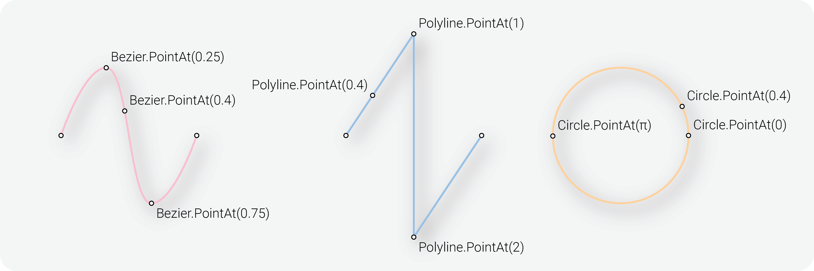

# Elements 2.0

We are pleased to present the upgrade to Hypar Elements 2.0, designed to provide enhanced functionality and improved usability for the Hypar community. This release introduces significant improvements and aligns Elements with common standards and industry specifications including IFCv4 and ISO 10303-42. While these enhancements bring exciting possibilities, it is important to note that some methods have undergone changes in behavior. This documentation serves as a guide to help you understand and adapt to the new features and modifications introduced in Elements 2.0.

These updates aim to improve the overall functionality and performance of Hypar Elements. Please make the necessary adjustments to your code to ensure compatibility and take advantage of the new features introduced in Elements 2.0.

If you have any questions or require further assistance, please reach out to our support team or consult the [Hypar Elements documentation](https://hypar-io.github.io/Elements/).

### 1.0 vs 2.0

In Hypar Elements 2.0, several elements have minor breaking changes. The following table highlights the differences between 1.0 and 2.0:

| Elements 1.0 | Elements 2.0 |
| --- | --- |
| Message.FromLine | Message.FromCurve |
| Polygon.Area() returns a signed area. | Polygon.Area() returns a positive value unless passed signed = false |
| PointAt(parameter)0→1 Domain | PointAt(parameter)0→[Type Specific Domain](#parameterization) |
| - | PointAtNormalized(parameter) Supported by BoundedCurve: Arc, Bezier, Line, Polyline <br> Note: This is Normalized across parameter space and not length. |
| - | Polyline.Mid() Domain based mid <br> Arc.Mid() Domain based mid <br> Bezier.Mid() Domain based mid |
| - | Start and End methods/properties added to: <br> Bezier <br> <br> Start and End methods/properties removed from: Circle |
| - | TransformAt methods follow the same rules as PointAt methods |
| - | All old Curve types are replaced with BoundedCurve: UnboundedCurve types such as Circle inherit the Curve class. Lines and other BoundedCurve have start and end points. <br> <br> This distinction allows for more accurate representation and manipulation of different curve types. You can find the updated implementation in [Elements 2.0 BoundedCurve](https://github.com/hypar-io/Elements/blob/master/Elements/src/Geometry/BoundedCurve.cs),  [Elements 2.0 Curve](https://github.com/hypar-io/Elements/blob/master/Elements/src/Geometry/Curve.cs).|

## Curve Parameterization
**Parameterization** refers to the process of assigning a unique value, called a parameter, to each point on a line or curve based on the **domain**. Different types have different parameter domains reflecting the underlying logic of their type, for instance `Circle` has a parameter domain of `0 → 2Pi` while `Line` has a parameter domain of `0 → Length` and `Bezier` has a parameter domain of `0→1`. Not all parameterizations are uniform, while `Bezier` is parameterized from `0→1`, the parameter `0.25` is not necessarily at 1/4 of the total distance along the length of the `Bezier`, this is because `Bezier` curves use a weighted sum of their control points to define their curvature - thus a parameter of 0.25 represents the point on the Bezier that is 1/4 of the Bezier in relation to its control points.



| Geometry<a id="parameterization"/> | Inherits | Parameterization |
| --- | --- | --- |
| Polyline | IndexedPolycurve | 0 → n, where n = number of vertices - 1 |
| Line | TrimmedCurve<InfiniteLine> | 0 → length |
| Bezier | BoundedCurve | 0 → 1, non-uniform. |
| Circle | Curve, IConic | 0 → 2Pi |
| Arc | TrimmedCurve<Circle> | 0 → 2Pi |
| Ellipse | Curve, IConic | 0 → 2Pi |

## Code Comparison

<table>
<tr>
<th>#Elements 1.0</th>
<th>#Elements 2.0</th>
</tr>
<tr>
<td>
<pre>

```csharp
// Find the point at the given parameter
// Line parameterization has a domain of 0->1
var point = line.PointAt(parameter);
```
</pre>
</td>
<td>
<pre>

```csharp
// Find the point at the given parameter
// Line parameterization is length based domain of 0->length
var parameterMod = parameter * line.Length();
var point = line.PointAt(parameterMod);
```

</pre>
</td>
</tr>
<tr></tr>
<tr>
<td>
<pre>

```csharp
// Find the point at the given parameter
// Bezier parameterization has a domain of 0->1
var point = _bezierwork.Bezier.PointAt(parameter);
```

</pre>
</td>
<td>
<pre>

```csharp
// Find the point at the given parameter
// Bezier parameterization has a domain of 0->1
var point = bezier.PointAt(parameter);
```

</pre>
</td>
</tr>
<tr></tr>
<tr>
<td>
<pre>

```csharp
// Find the point at the given parameter
// Circle parameterization has a domain of 0->1
var point = _circlework.Circle.PointAt(parameter);
```

</pre>
</td>
<td>
<pre>

```csharp
// Find the point at the given parameter
// Circle parameterization has a domain of 0->2PI
var parameterMod = parameter * (2 * Math.PI);
var point = circle.PointAt(parameterMod);
```

</pre>
</td>
</tr>
<tr></tr>
<tr>
<td>
<pre>

```csharp
// Find the point at the given parameter
// Arc parameterization has a domain of 0->1
var point = _arcwork.Arc.PointAt(parameter);
```

</pre>
</td>
<td>
<pre>

```csharp
// Find the point at the given parameter
// Arc parameterization has a domain of 0->2PI
var parameterMod = parameter * (2 * Math.PI);
var point = arc.PointAt(parameterMod);
```

</pre>
</td>
</tr>
<tr></tr>
<tr>
<td>
<pre>

```csharp
// Elements 1.0 does not contain an Ellipse class
```

</pre>
</td>
<td>
<pre>

```csharp
// Find the point at the given parameter
// Ellipse parameterization has a domain of 0->2PI
var parameterMod = parameter * (2 * Math.PI);
var point = ellipse.PointAt(parameterMod);
```

</pre>
</td>
</tr>
</table>